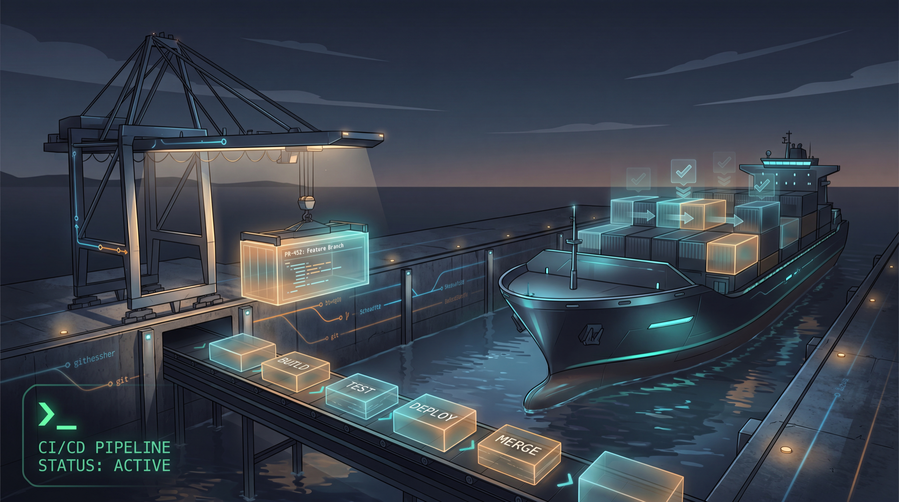

<p align="center">
  
</p>

# shipyard

[](https://github.com/edihasaj/shipyard/actions/workflows/ci.yml)
[](https://github.com/edihasaj/shipyard/releases)
[](https://pkg.go.dev/github.com/edihasaj/shipyard)
[](LICENSE)

**Point an agent at a repo + a task. Get a PR-ready branch back.**

shipyard runs a per-task pipeline against any repo you've configured, so you
stop doing the manual loop by hand:

```
resolve task → branch (your convention) → implement → gates (lint/type/test)
→ security review → adversarial code review → PR description → optional smoke
→ stop PR-ready  |  open a PR     (per the repo's config)
```

The pipeline logic is an installable **skill**; this binary is the launcher +
config layer around it. One config file per repo describes what differs
(task source, branch/commit convention, gates, push policy). Add a repo = add
a YAML, not new code.

## Install

```sh
# Homebrew (tap)
brew install edihasaj/tap/shipyard

# or from source
go install github.com/edihasaj/shipyard@latest

# install the pipeline skill for your agent (Claude Code by default)
shipyard install-skill
```

shipyard shells out to an agent CLI (default `claude`; override with
`$SHIPYARD_AGENT` or `--agent`).

### shipyard is a launcher, not an LLM client

shipyard contains **no model API calls** and no API key. It resolves your repo
config, builds the task prompt, and execs an agent CLI — the agent does the
thinking. The pipeline itself is the bundled `ship-task` skill (`SKILL.md`).
This keeps shipyard thin and lets it ride your agent's existing tools (`gh`,
`git`, MCP, `/security-review`, `/code-review`), repo context, and permission
model instead of reimplementing them.

### Agents

Each agent has an **invocation profile** (how shipyard renders the prompt and
builds argv). Pick it with `--agent-profile` or `$SHIPYARD_AGENT_PROFILE`;
otherwise it's inferred from the agent binary name.

| Profile | Agent | How the task is delivered |
|---|---|---|
| `claude` *(default)* | Claude Code | `/ship-task` slash command (runs the installed skill) |
| `codex` | OpenAI Codex CLI | pipeline inlined in the prompt; `codex exec` when headless |
| `generic` | any other CLI | pipeline inlined in the prompt; passed as one positional arg |

Skill-aware agents (Claude Code) use the installed skill; others receive the
full pipeline inlined in the prompt, so they don't need a separate install
step. Add an agent by adding a profile in `internal/agent` — no launch-path
changes.

## Configure a repo

```sh
shipyard init my-app          # scaffolds ~/.config/shipyard/repos/my-app.yml
$EDITOR ~/.config/shipyard/repos/my-app.yml
```

Config home resolves in order: `$SHIPYARD_HOME` → `./.shipyard` →
`$XDG_CONFIG_HOME/shipyard` (default `~/.config/shipyard`). Run `shipyard where`
to see the resolved paths. Configs are **yours** — keep them private; shipyard
itself ships only the schema + examples.

A minimal config:

```yaml
key: my-app
path: ~/code/my-app
task_source: github
github: { repo: acme/my-app }
base_branch: main
branch_format: "{type}/{slug}"
branch_types: { feature: feat, bug: fix, chore: chore }
commit_convention: conventional
gates:
  install: "pnpm install"
  lint: "pnpm lint"
  typecheck: "tsc --noEmit"
  test: "pnpm test"
review: { security: true, level: high }
pr: { base: main, draft: false }
push: ask              # manual | pr | ask
```

See [`internal/assets/schema/_schema.yml`](internal/assets/schema/_schema.yml)
for every field, documented.

## Use

```sh
shipyard list                                  # configured repos
shipyard my-app "add CSV export to reports"     # free-text task
shipyard my-app ABC-123                          # Jira key
shipyard my-app "#86 fix null totals"            # GitHub issue
shipyard https://github.com/acme/my-app/issues/86   # paste a URL — repo inferred
```

Or, inside an agent session already in the repo: `/ship-task my-app ABC-123`.

## Push policy is the safety rail

- `push: manual` — never pushes. Stops PR-ready and hands back. Use for
  enterprise repos where you push by hand.
- `push: ask` — summarizes, then asks.
- `push: pr` — pushes and opens the PR automatically.

## Commands

| Command | What |
|---|---|
| `shipyard <repo> <task>` | run the pipeline (`-p`/`--print` for headless; `--agent`/`--agent-profile` to pick the agent) |
| `shipyard list` | list configured repos |
| `shipyard init <repo>` | scaffold a config from the schema |
| `shipyard install-skill` | install the ship-task skill for the agent |
| `shipyard where` | print the resolved config home |

## License

MIT © Edi Hasaj
